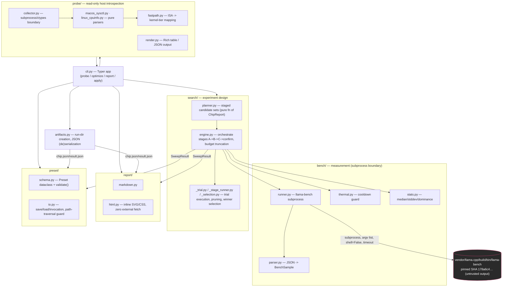

# neonpilot — Architecture

This document describes the system as built (`src/neonpilot/`), cross-referenced against the
design in [`PLAN.md`](./PLAN.md). Where the implementation deviated from the plan in a minor,
non-contract-breaking way, see [`docs/dev/build-notes.md`](./docs/dev/build-notes.md) — those
deviations are noted inline below rather than repeated in full.

## Module map



**Design rule enforced throughout:** no module under `probe/`, `bench/`, `search/`, `report/`, or
`preset/` imports `cli.py` — `cli.py` is a thin Typer/Rich shell that only calls *into* the
package, keeping every other module independently unit-testable. `bench/runner.py` is the sole
spawn point for the untrusted `llama-bench` binary; adapters under `probe/` never call
`subprocess` themselves — `probe/collector.py` is the single subprocess/`ctypes` boundary feeding
pure, injectable-text parsers (`macos_sysctl.py`, `linux_cpuinfo.py`), which makes probe logic
testable purely from captured fixtures (`tests/fixtures/sysctl_apple_m1_max.txt`).

## Data flow

```
neonpilot optimize model.gguf
        |
        v
  probe_host() ------------------> ChipReport  (also `neonpilot probe` standalone)
        |                               |
        v                               v
  planner.plan(chip, budget) -----> SearchPlan (staged candidate list, placeholder threads
        |                                       in Stage B/C until engine substitutes the
        |                                       real Stage A winner — build-notes item 8)
        v
  engine.run(plan, ctx):
        1. measure baseline first (argv omits every tuning flag -> llama.cpp's own defaults)
        2. Stage A (threads) -> pick winner A*
        3. Stage B (flash_attn x kv-cache, threads=A*) -> pick winner B*
        4. Stage C (batch/ubatch, threads=A*, fa/kv=B*) -> pick winner C*
        5. confirm pass: re-measure baseline vs C* back-to-back
        each step: runner.run_bench(reps) -> parser.parse -> BenchSample[]
                   thermal.cooldown() between candidates (adaptive, idle-skip)
                   stats.dominates(best, candidate) -> prune remainder of that stage
        v
   SweepResult (baseline + all trials incl. pruned + best + speedups + truncation flags)
        |
        +--> artifacts.dump ---> ~/.neonpilot/runs/<ts>/{chip.json, plan.json,
        |                          trials.json, result.json, run.log}
        |
        +--> report.render_markdown / render_html --> runs/<ts>/report.{md,html}
        |
        +--> preset.save (on `apply`) --> presets/<chip-id>/<model-class>.json  (in-tree)
```

### Artifact locations

| Artifact | Location | Why |
|---|---|---|
| Per-run artifacts | `~/.neonpilot/runs/<ISO-timestamp>/`, `latest` symlink | Ephemeral, machine-specific, noisy (every pruned trial + logs) — kept out of the working tree so a clean clone stays clean. `--out DIR` overrides (CI passes `--out ./runs` to make it an uploadable Actions artifact). |
| Curated presets | `./presets/<chip-id>/<model-class>.json` | Small, reviewable, meant to be committed and diffed — a real deliverable (FR4), not a byproduct. |
| Downloaded models | `~/.neonpilot/models/` | Shared cache across runs/branches, git-ignored. |
| `llama.cpp` source + build | `vendor/llama.cpp/` (git-ignored) | Fetched at the pinned SHA, not vendored into the repo — keeps repo small and licensing clean. |

## Core data contracts

All dataclasses live in `neonpilot/models.py`, are `@dataclass(frozen=True)` (immutable, matching
repo-wide coding style), and serialize via `dataclasses.asdict` with 2-space indent, sorted keys,
trailing newline (`artifacts.dump`). Full field lists are in `models.py`/`PLAN.md` §1.3; the
shapes that matter for integration:

- **`ChipReport`** — chip name/id, P/E/total core counts, RAM, an `isa: dict[str, bool]` (`neon`,
  `dotprod`, `i8mm`, `sve`, `sve2`, `sme`, `sme2`, `bf16`, `fp16`), and `fast_paths:
  list[FastPathNote]` (feature, kernel, active, why).
- **`RuntimeConfig`** — the tunable surface: `threads`, `cache_type_k/v`, `flash_attn`, `batch`,
  `ubatch`. This is what a `TrialResult`/`Preset` carries as "the winning flags."
- **`BenchSample`** — one `llama-bench` JSON row: `test_type` (`pp`/`tg`), `avg_ts`, `stddev_ts`,
  `samples_ts[]`. neonpilot trusts `llama-bench`'s own average/stddev per config; `bench/stats.py`
  is used only for cross-config dominance/median selection, never to re-pool within-config
  variance.
- **`TrialResult`** — one measured (or pruned/errored) candidate: `trial_id`, `stage`, `config`,
  `prefill`/`generation` samples, `thermal`, `status` (`ok`/`pruned`/`error`).
- **`SweepResult`** — the top-level `optimize` output: `baseline`, `trials[]`, `best`,
  `speedup_gen_pct`/`speedup_prefill_pct`, `budget_truncated`, `dropped_stages[]`.
- **`Preset`** — a `SweepResult` winner packaged with full provenance: the whole `ChipReport`
  (not just an id), the pinned `llama_cpp_commit`, baseline/tuned t/s + stddev, `server_flags`
  (plain-text `llama-server` equivalent — no binary dependency), `schema_version`.

## Key design decisions and rationale

| Decision | Choice | Rationale |
|---|---|---|
| Benchmark harness | Subprocess `llama-bench -o json`, never in-process bindings | Full fidelity to the pinned binary's exact flags; JSON is a stable machine contract; isolates untrusted native code with a hard timeout. `llama-cli` isn't even built (doesn't exist with examples off) — `llama-bench` covers every measurement need. See [ADR 0001](./docs/adr/0001-pinned-llama-cpp-subprocess.md). |
| Search strategy | Staged greedy hill-climb (A→B→C→confirm), not a full grid | Worst case 16 configs vs. 36+ for the Cartesian product of thread/KV/flash-attn/batch candidates — fits the 15-minute budget with headroom. See [ADR 0002](./docs/adr/0002-staged-sweep-search.md). |
| Backend | CPU-only; `-DGGML_METAL=OFF -DGGML_BLAS=OFF -DGGML_CPU_KLEIDIAI=ON` | The project's entire premise is Arm CPU kernel tuning — GPU acceleration would make every comparison meaningless. See [ADR 0003](./docs/adr/0003-cpu-only-metal-off.md). |
| Truncation order | Drop *adaptive cooldown extras → Stage C → confirm pass* last-resort only, never Stage A/B | Stage A/B carry most of the measurable gain; the confirm pass is needed for the fair back-to-back baseline comparison (§9's speedup number). Both are protected until truncation genuinely has nowhere else to cut. |
| Probe input | Adapters take injected text (`sysctl -a` output, `/proc/cpuinfo` text); `probe/collector.py` is the only subprocess/`ctypes` boundary | Parsers become pure functions, trivially unit-testable against captured fixtures without needing the exact hardware. |
| Data modeling | Frozen dataclasses + hand-rolled `asdict`/`from_dict`, no Pydantic | stdlib-only, immutable, stable diffs; the shape-checking neonpilot needs (`preset/schema.py::validate`) is a hand-written allow-list/range check, not a general validation framework. |
| Stats | stdlib `statistics` + a single dominance rule (`best - k·stddev > cand + k·stddev`, k=1.0) | No numpy/scipy dependency; `llama-bench` already supplies per-rep samples and its own avg/stddev — neonpilot only needs cross-config comparison. |
| Config storage | JSON everywhere (runs, presets) | One format end-to-end, stdlib `json`, machine-readable for `report`/`apply` without extra dependencies. |

## Security posture summary

Full detail in [`SECURITY.md`](./SECURITY.md) (STRIDE-based audit, all MEDIUM/LOW findings fixed
or explicitly accepted-and-documented as of the current commit). The load-bearing controls:

- **No `shell=True` anywhere.** All subprocess calls (`bench/runner.py`, `probe/collector.py`) use
  argv lists with `shell=False` and explicit hard timeouts; a grep for `shell=True`/`os.system`/
  `eval`/`exec` is clean.
- **Untrusted `llama-bench` output is validated, not trusted blindly.** `bench/parser.py` checks
  JSON shape (non-empty array, expected keys, numeric fields parse) before use; malformed
  output/non-zero exit becomes `TrialResult(status="error")`, never a crash.
- **Untrusted community presets are never blindly executed.** `preset/schema.py::validate` enforces
  `schema_version`, scalar types, enum allow-lists (`flash_attn`, `cache_type_k/v`), numeric range
  bounds, and a bare-filename check on `model_file`. `apply` only *prints* the re-emitted
  invocation (every argv token `shlex.quote`-d) for the user to review and run themselves.
- **Path-traversal guarded.** Packaging a shared run directory into a preset sanitizes `chip_id`/
  `model_class` to a safe slug pattern and asserts the resolved path stays under the presets root
  before any write.
- **Pinned, content-addressed supply chain.** `scripts/fetch_llama.sh` fetches a specific 40-char
  commit SHA over HTTPS and asserts the checkout landed on that exact SHA; a `.pin` stamp guards
  against a poisoned CI build cache.
- **No secrets, no telemetry, no runtime network calls.** A local CLI; the HTML report has zero
  external asset references (`test_no_external_assets.py`), so opening it leaks nothing.
